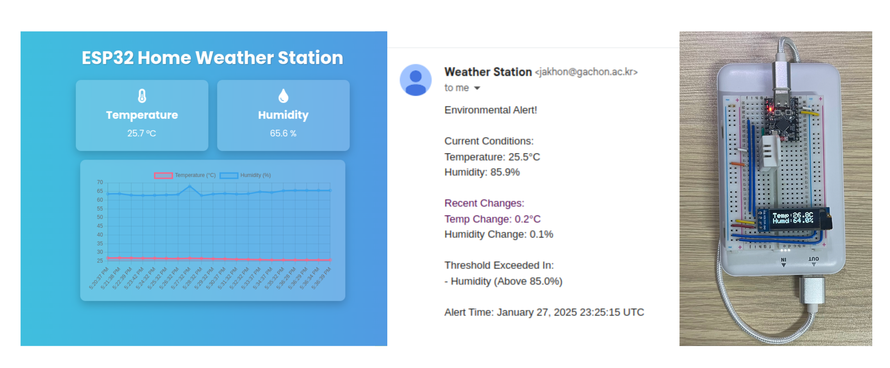
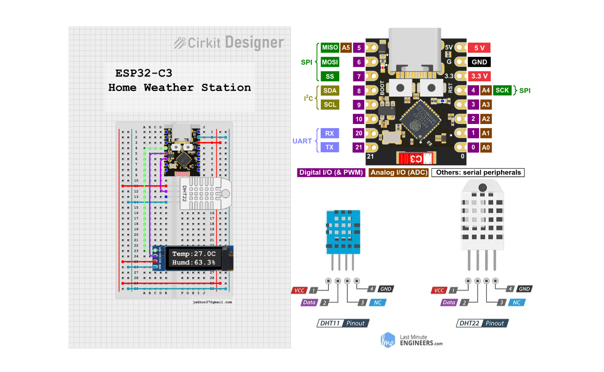
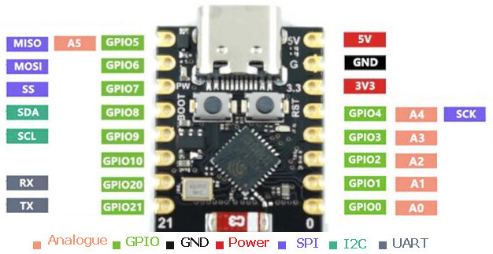
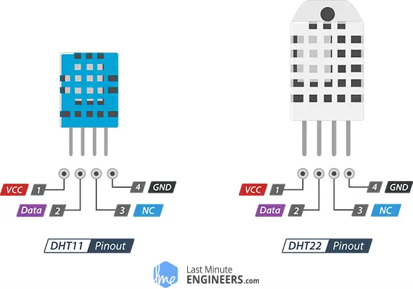

# ESP32-C3 Home Weather Alert System

<!-- Use a local or remote reference to your main image showcasing the project, e.g., a web GUI screenshot. -->


## Table of Contents

- [Overview](#overview)
- [Features](#features)
- [Hardware Requirements](#hardware-requirements)
  - [Example Hardware Setup](#example-hardware-setup)
  - [ESP32-C3 Pinout](#esp32-c3-pinout)
  - [DHT Sensor Pinouts](#dht-sensor-pinouts)
- [Software Requirements](#software-requirements)
- [Installation](#installation)
  - [1. Install PlatformIO](#1-install-platformio)
  - [2. Clone the Repository](#2-clone-the-repository)
  - [3. Open the Project in VSCode](#3-open-the-project-in-vscode)
  - [4. Install Dependencies](#4-install-dependencies)
- [Configuration](#configuration)
  - [1. Configure Wi-Fi Credentials](#1-configure-wi-fi-credentials)
  - [2. Adjust SMTP Port and Security Settings](#2-adjust-smtp-port-and-security-settings)
  - [3. Calibrate Alert Thresholds](#3-calibrate-alert-thresholds)
- [Usage](#usage)
  - [1. Using VSCode PlatformIO Extension](#1-using-vscode-platformio-extension)
  - [2. Using Terminal with PlatformIO CLI](#2-using-terminal-with-platformio-cli)
- [Project Structure](#project-structure)
- [Troubleshooting](#troubleshooting)
- [Contributing](#contributing)
  - [Code of Conduct](#code-of-conduct)
- [License](#license)
- [Acknowledgments](#acknowledgments)

---

## Overview

The **ESP32-C3 Home Weather Alert System** uses an ESP32-C3 microcontroller to monitor temperature and humidity via a **DHT** sensor. When significant changes in these parameters are detected beyond predefined thresholds, the system automatically sends out email alerts to designated recipients. The project also features a **web-based GUI** for real-time data monitoring and configuration, including threshold adjustments, NTP synchronization, and debug logs.

---

## Features

- **Real-Time Sensor Monitoring**: Continuously reads temperature and humidity data using a DHT sensor (DHT11 or DHT22).
- **Email Alerts**: Automates email notifications when significant changes in temperature or humidity occur.
- **Web-Based GUI**: Offers a user-friendly interface to view sensor data and manage system settings.
- **NTP Time Sync**: Ensures accurate timestamps by synchronizing with an NTP server.
- **Network Resilience**: Reconnects to Wi-Fi automatically if the connection is lost.
- **Configurable Thresholds**: Allows you to set high/low temperature and humidity thresholds.
- **Debug Logging**: Provides detailed logs for troubleshooting.

---

## Hardware Requirements

- **ESP32-C3 Development Board** (e.g., ESP32-C3-DevKitM-1)
- **DHT Sensor** (DHT11 or DHT22)
- **OLED or LCD Display** (Optional, but recommended for local data visualization)
- **Jumper Wires**
- **Breadboard** (Optional, for prototyping)
- **USB Cable / Power Adapter** for ESP32

### Example Hardware Setup

Below is a **breadboard wiring diagram** showing how to connect a **DHT22** sensor and an **OLED** display to the **ESP32-C3**:



1. **DHT22 Connections**:
   - **Pin 1 (VCC)** → **3.3V** on ESP32
   - **Pin 2 (Data)** → **GPIO10** on ESP32
   - **Pin 3 (NC)** → Not Connected
   - **Pin 4 (GND)** → **GND** on ESP32

2. **OLED Connections**:
   - **VCC** → **3.3V** on ESP32
   - **GND** → **GND** on ESP32
   - **SDA** → **GPIO8** (SDA default for ESP32-C3)
   - **SCK** → **GPIO9** (SCL default for ESP32-C3)

### ESP32-C3 Pinout

From the above image, you can see there is a **pinout diagram** for the ESP32-C3 DevKit, showing default I2C pins (GPIO8 for SDA, GPIO9 for SCL) and available GPIO pins:

<!--  -->

### DHT Sensor Pinouts

Depending on your DHT sensor model, use the corresponding pinout diagram:

<!--  -->

- **DHT11** or **DHT22** typically have:
  - **VCC** (3.3V)
  - **Data**
  - **NC** (Not Connected)
  - **GND**

---

## Software Requirements

- **PlatformIO**: Cross-platform build system, integrated into **VSCode**.
- **Arduino Framework**: Underlying development environment for the ESP32.
- **Adafruit DHT Sensor Library**: For interfacing with the DHT sensor.
- **ESP Mail Client Library**: For sending email alerts.
- **LiquidCrystal_I2C** or **Adafruit_SSD1306** (optional) for display usage.

---

## Installation

### 1. Install PlatformIO

If you haven't installed PlatformIO yet, follow these steps:

1. **Install Visual Studio Code (VSCode)**:
   - Download and install from [VSCode Download](https://code.visualstudio.com/).

2. **Install PlatformIO Extension**:
   - Open VSCode.
   - Navigate to the Extensions panel (`Ctrl+Shift+X` or `Cmd+Shift+X` on macOS).
   - Search for `PlatformIO IDE` and install the official extension.

3. **Verify Installation**:
   - Click on the PlatformIO icon in the sidebar to open PlatformIO Home.
   - Ensure PlatformIO Core is up-to-date.

### 2. Clone the Repository

```sh
git clone https://github.com/jakhon37/esp32-c3-home-weather-alert.git
cd esp32-c3-home-weather-alert
```

### 3. Open the Project in VSCode

1. **File > Open Folder**
2. Select the cloned `esp32-c3-home-weather-alert` directory.
3. PlatformIO should automatically detect the project.

### 4. Install Dependencies

Open a new terminal in VSCode (`Ctrl+`` or **View > Terminal**) and run:

```sh
pio run
```

Or click the **PlatformIO Build** button (checkmark icon) or press `Ctrl+Shift+P` → `PlatformIO: Build`.


PlatformIO will fetch and install necessary libraries defined in `platformio.ini`.

---

## Configuration

### 1. Configure Wi-Fi Credentials

Edit `include/Config.h`:

```cpp
#ifndef CONFIG_H
#define CONFIG_H

// WiFi Configuration
const char* WIFI_SSID = "Your_WiFi_SSID";
const char* WIFI_PASSWORD = "Your_WiFi_Password";

// Email Configuration
const char* SMTP_HOST = "smtp.gmail.com";
const uint16_t SMTP_PORT = 587; // 465 for SSL/TLS
const char* AUTHOR_EMAIL = "your_email@gmail.com";
const char* AUTHOR_PASSWORD = "your_email_password_or_app_specific_password";
const char* RECIPIENT_EMAIL = "recipient_email@example.com";

// Alert Thresholds
const float TEMP_CHANGE_THRESHOLD = 5.0; // °C
const float HUM_CHANGE_THRESHOLD = 10.0; // %
const unsigned long ALERT_COOLDOWN = 60000; // 1 min in ms

#endif // CONFIG_H
```

**Security Note**: For production or public repos, avoid hardcoding credentials—consider app passwords or environment variables.

### 2. Adjust SMTP Port and Security Settings

- **Port 587** for **STARTTLS**.
- **Port 465** for **SSL/TLS**.

### 3. Calibrate Alert Thresholds

Set `TEMP_CHANGE_THRESHOLD` and `HUM_CHANGE_THRESHOLD` to fine-tune alert sensitivity.

---

## Usage

You can build, upload, and monitor your project via **VSCode** or **Terminal**.

### 1. Using VSCode PlatformIO Extension

1. **Build**:
   - Click the **PlatformIO Build** button (checkmark icon) or press `Ctrl+Shift+P` → `PlatformIO: Build`.

2. **Upload**:
   - Connect ESP32-C3 via USB.
   - Click the **PlatformIO Upload** button (right arrow icon).

3. **Monitor Serial**:
   - Click the **PlatformIO Monitor** button (plug icon).
   - Set baud rate to **115200** if prompted.

4. **Web GUI**:
   - Check the Serial output for your ESP32 IP address.
   - Open a browser and go to `http://<ESP32_IP_Address>`.

### 2. Using Terminal with PlatformIO CLI

1. **Install PlatformIO CLI** (if not already):
   ```sh
   pip install platformio
   ```

2. **Build**:
   ```sh
   pio run
   ```

3. **Upload**:
   ```sh
   pio run -t upload
   ```

4. **Monitor**:
   ```sh
   pio device monitor -b 115200
   ```

5. **Web GUI**:
   - Note the IP address in the Serial Monitor.
   - Open `http://<ESP32_IP_Address>` in your browser.

---

## Project Structure

```
esp32-c3-home-weather-alert/
├── include/
│   ├── Config.h
│   └── (other headers)
├── lib/
│   ├── DhtSensor/
│   ├── EmailClient/
│   ├── WebGui/
│   ├── OLEDDisplay/ (or LCDisplay/)
│   └── ...
├── src/
│   └── main.cpp
├── test/
├── platformio.ini
├── README.md
└── CODE_OF_CONDUCT.md
```

- **include/**: Shared headers and configurations (`Config.h`).
- **lib/**: Custom libraries (e.g., `DhtSensor`, `EmailClient`, `WebGui`, `OLEDDisplay`/`LCDisplay`).
- **src/**: Main application source (`main.cpp`).
- **test/**: Unit or integration tests.
- **platformio.ini**: PlatformIO build and dependency configuration.
- **README.md**: Project documentation.

---

## Troubleshooting

1. **Check Wiring**:
   - Ensure DHT sensor pinout is correct.
   - Verify SDA and SCL pins for I2C devices (OLED) match the code.

2. **I2C Address**:
   - If the OLED isn't displaying, use an I2C scanner to confirm the address (`0x3C`, etc.).

3. **Serial Monitor**:
   - Watch logs for Wi-Fi connection issues, sensor read failures, or email errors.
   - Increase debug outputs if needed.

4. **Email Credentials**:
   - If using Gmail with 2FA, generate an [App Password](https://support.google.com/accounts/answer/185833) instead of your normal password.

5. **NTP Sync**:
   - Verify the NTP server address if time synchronization fails.

---

## Contributing

1. **Fork and Clone**:
   ```sh
   git clone https://github.com/<yourusername>/esp32-c3-home-weather-alert.git
   cd esp32-c3-home-weather-alert
   ```

2. **Create a Branch**:
   ```sh
   git checkout -b feature/AmazingFeature
   ```

3. **Make Changes & Commit**:
   ```sh
   git commit -m "Add AmazingFeature"
   ```

4. **Push & Pull Request**:
   ```sh
   git push origin feature/AmazingFeature
   ```
   - Submit a PR on GitHub.

### Code of Conduct

Please follow the [Code of Conduct](https://github.com/jakhon37/esp32-c3-home-weather-alert/blob/main/CODE_OF_CONDUCT.md) to help maintain a welcoming environment for all contributors.

---

## License

Distributed under the **MIT License**. Refer to `LICENSE` for details.

---

## Acknowledgments

- [ESP-Mail-Client by Mobizt](https://github.com/mobizt/ESP-Mail-Client) — robust email sending support.
- [Adafruit DHT Sensor Library](https://github.com/adafruit/DHT-sensor-library) — easy DHT sensor handling.
- [Adafruit SSD1306 / LiquidCrystal_I2C](https://github.com/adafruit/) — display libraries for visual feedback.
- The open-source community for invaluable resources, examples, and troubleshooting help.

---

If you have any questions or need support, please open an issue in the [GitHub repository](https://github.com/jakhon37/esp32-c3-home-weather-alert/issues).  