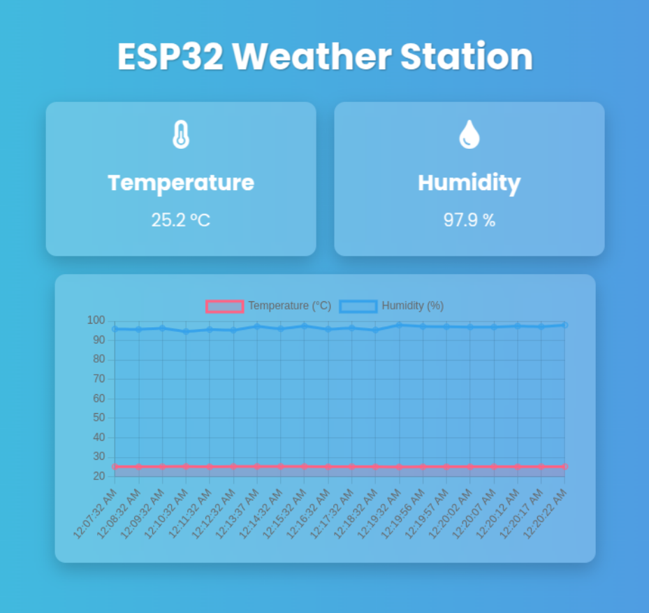

# ESP32 Weather Alert System

<!--  -->




## Table of Contents

- [Overview](#overview)
- [Features](#features)
- [Hardware Requirements](#hardware-requirements)
- [Software Requirements](#software-requirements)
- [Installation](#installation)
- [Configuration](#configuration)
- [Usage](#usage)
- [Project Structure](#project-structure)
- [Troubleshooting](#troubleshooting)
- [Contributing](#contributing)
- [License](#license)
- [Acknowledgments](#acknowledgments)

## Overview

The **ESP32 Weather Alert System** is a comprehensive project that utilizes an ESP32 microcontroller to monitor environmental conditions such as temperature and humidity. When sudden changes in these parameters are detected beyond predefined thresholds, the system sends alert emails to designated recipients. Additionally, the project includes a web-based GUI for real-time monitoring and configuration.

## Features

- **Real-Time Sensor Monitoring:** Continuously reads temperature and humidity data using a DHT sensor.
- **Email Alerts:** Sends automated email notifications when significant changes in temperature or humidity are detected.
- **Web-Based GUI:** Provides a user-friendly interface to monitor sensor data and manage settings.
- **NTP Time Synchronization:** Ensures accurate timestamping of emails and logs by syncing with NTP servers.
- **Network Resilience:** Automatically reconnects to Wi-Fi in case of disconnections.
- **Configurable Thresholds:** Allows customization of temperature and humidity change thresholds for alerts.
- **Debugging Support:** Detailed logs for easy troubleshooting and monitoring of system performance.

## Hardware Requirements

- **ESP32 Development Board:** Compatible with ESP32-C3 or other ESP32 variants.
- **DHT Sensor:** DHT11, DHT22, or compatible temperature and humidity sensor.
- **Jumper Wires:** For connecting the DHT sensor to the ESP32.
- **Breadboard:** Optional, for prototyping connections.
- **Power Supply:** USB cable or suitable power adapter for the ESP32.

### Example Hardware Setup


<!--  -->

## Software Requirements

- **PlatformIO:** An open-source ecosystem for IoT development with cross-platform build system.
- **Visual Studio Code (VSCode):** Recommended IDE with PlatformIO extension.
- **ESP Mail Client Library:** For managing SMTP sessions and sending emails.
- **Adafruit DHT Sensor Library:** For interfacing with the DHT sensor.
- **Arduino Framework:** For programming the ESP32.

## Installation

### 1. Install PlatformIO

If you haven't installed PlatformIO yet, follow these steps:

1. **Install Visual Studio Code (VSCode):**
   - Download and install from [here](https://code.visualstudio.com/).

2. **Install PlatformIO Extension:**
   - Open VSCode.
   - Navigate to the Extensions panel (`Ctrl+Shift+X` or `Cmd+Shift+X` on macOS).
   - Search for `PlatformIO IDE` and install the official extension.

3. **Verify Installation:**
   - Open the PlatformIO Home by clicking on the PlatformIO icon in the sidebar.
   - Ensure that PlatformIO Core is up-to-date.

### 2. Clone the Repository

Clone this repository to your local machine:

```sh
git clone https://github.com/jakhon37/esp32-c3-home-weather-alert.git
cd esp32-weather-alert
```

### 3. Open the Project in VSCode

1. Open VSCode.
2. Navigate to **File > Open Folder** and select the cloned `esp32-weather-alert` directory.
3. PlatformIO should automatically detect the project configuration.

### 4. Install Dependencies

Ensure that all required libraries are installed. PlatformIO manages dependencies via the `platformio.ini` file. To install them:

1. Open the Terminal in VSCode (`Ctrl+` or **View > Terminal**).
2. Run the build command to trigger library installation:

   ```sh
   pio run
   ```

   PlatformIO will automatically download and install the necessary libraries specified in `platformio.ini`.

## Configuration

### 1. Configure Wi-Fi Credentials

Edit the `Config.h` file to include your Wi-Fi and email credentials.

**`include/Config.h`:**

```cpp
#ifndef CONFIG_H
#define CONFIG_H

// WiFi Configuration
const char* WIFI_SSID = "Your_WiFi_SSID";
const char* WIFI_PASSWORD = "Your_WiFi_Password";

// Email Configuration
const char* SMTP_HOST = "smtp.gmail.com";
const uint16_t SMTP_PORT = 587; // Use 587 for STARTTLS or 465 for SSL/TLS
const char* AUTHOR_EMAIL = "your_email@gmail.com";
const char* AUTHOR_PASSWORD = "your_email_password_or_app_specific_password";
const char* RECIPIENT_EMAIL = "recipient_email@example.com";

// Alert Thresholds
const float TEMP_CHANGE_THRESHOLD = 5.0;       // Temperature change threshold in °C
const float HUM_CHANGE_THRESHOLD = 10.0;       // Humidity change threshold in %
const unsigned long ALERT_COOLDOWN = 60000;    // Cooldown period in milliseconds (e.g., 1 minute)

#endif // CONFIG_H
```

**Security Note:** For enhanced security, consider using App Passwords or environment variables to manage sensitive credentials. Avoid hardcoding passwords directly in the source code, especially if the code is stored in a public repository.

### 2. Adjust SMTP Port and Security Settings

- **Port 587:** Recommended for **STARTTLS** encryption.
- **Port 465:** Recommended for **SSL/TLS** encryption.

Ensure that the `SMTP_PORT` in `Config.h` matches your chosen security protocol.

### 3. Calibrate Alert Thresholds

Modify the `TEMP_CHANGE_THRESHOLD` and `HUM_CHANGE_THRESHOLD` in `Config.h` to set the desired sensitivity for alerts.

## Usage

### 1. Upload the Firmware to ESP32

1. Connect your ESP32 development board to your computer via USB.
2. Select the appropriate board and port in PlatformIO:
   - Open the PlatformIO Home.
   - Navigate to **Projects > [Your Project] > PlatformIO**.
   - Ensure that the `platformio.ini` has the correct board configuration.
3. Build and upload the firmware:
   
   ```sh
   pio run -t upload
   ```

4. Monitor the serial output to ensure successful deployment:

   ```sh
   pio device monitor -b 115200
   ```

### 2. Monitor Sensor Data and Alerts

- The system will continuously read temperature and humidity data.
- If sudden changes exceed the defined thresholds, an email alert will be sent to the specified recipient.
- Logs and debug information will be available via the serial monitor for troubleshooting and verification.

### 3. Access the Web-Based GUI

- (If implemented) Access the web GUI by navigating to the ESP32's IP address in a web browser.
- Use the GUI to monitor real-time sensor data and adjust settings as needed.

## Project Structure

```
esp32-weather-alert/
├── include/
│   ├── Config.h
│   └── ... (other header files)
├── lib/
│   ├── EmailClient/
│   │   ├── EmailClient.h
│   │   └── EmailClient.cpp
│   ├── DhtSensor/
│   │   ├── DhtSensor.h
│   │   └── DhtSensor.cpp
│   └── ... (other libraries)
├── src/
│   ├── main.cpp
│   └── ... (other source files)
├── test/
│   └── ... (test files)
├── platformio.ini
└── README.md
```

- **include/**: Contains configuration headers and shared declarations.
- **lib/**: Houses custom libraries like `EmailClient` and `DhtSensor`.
- **src/**: Main application source files.
- **test/**: Unit tests and minimal test cases.
- **platformio.ini**: PlatformIO project configuration file.
- **README.md**: Project documentation.

## Troubleshooting

### Common Issues and Solutions

1. **SMTPData Does Not Name a Type:**
   - **Cause:** `SMTPData` class is deprecated in ESP Mail Client v3.x.
   - **Solution:** Use `SMTPSession` and `SMTP_Message` instead. Ensure that your `EmailClient` class is updated accordingly.

2. **Lambda Function Capturing 'this':**
   - **Cause:** Callback lambda does not capture the `this` pointer, preventing access to class members.
   - **Solution:** Modify the lambda to capture `this` by using `[this](SMTP_Status status) { ... }`.

3. **Undefined Constants:**
   - **Cause:** Constants like `esp_mail_content_type_plain_text` are not recognized.
   - **Solution:** Ensure correct constant names are used as per the ESP Mail Client documentation. Alternatively, define them manually if necessary.

4. **Failed to Send Email:**
   - **Cause:** Incorrect SMTP configuration, network issues, or authentication failures.
   - **Solution:** 
     - Verify SMTP host and port.
     - Ensure Wi-Fi connectivity.
     - Use App Passwords if using Gmail and two-factor authentication.
     - Check firewall or ISP restrictions on SMTP ports.

5. **Serial Monitor Shows No Output:**
   - **Cause:** Incorrect board selection or connection issues.
   - **Solution:** 
     - Ensure the correct board is selected in `platformio.ini`.
     - Check USB connections and drivers.
     - Restart the ESP32 board.

### Additional Debugging Steps

- **Enable Debugging:**
  - Ensure `smtp.debug(1);` is enabled in `EmailClient.cpp` to get detailed logs.
  
- **Check Serial Monitor:**
  - Use the serial monitor to view logs and identify where the process might be failing.
  
- **Verify NTP Time Synchronization:**
  - Ensure that the ESP32 can reach NTP servers to synchronize time, which is crucial for timestamping emails.

## Contributing

Contributions are welcome! Please follow these steps to contribute to the project:

1. **Fork the Repository:**
   - Click the **"Fork"** button on the repository page.

2. **Clone Your Fork:**
   ```sh
   git clone https://github.com/<yourusername>/esp32-c3-home-weather-alert.git
   cd esp32-c3-home-weather-alert
   ```

3. **Create a New Branch:**
   ```sh
   git checkout -b feature/YourFeatureName
   ```

4. **Make Changes and Commit:**
   ```sh
   git commit -m "Add Your Feature"
   ```

5. **Push to Your Fork:**
   ```sh
   git push origin feature/YourFeatureName
   ```

6. **Create a Pull Request:**
   - Navigate to the original repository and create a pull request from your fork.

### Code of Conduct

Please adhere to the [Code of Conduct](https://github.com/jakhon37/esp32-c3-home-weather-alert/blob/main/CODE_OF_CONDUCT.md) when contributing to this project.

## License

Distributed under the MIT License. See `LICENSE` for more information.

## Acknowledgments

- [ESP-Mail-Client by Mobizt](https://github.com/mobizt/ESP-Mail-Client) for providing the robust mail client library.
- [Adafruit DHT Sensor Library](https://github.com/adafruit/DHT-sensor-library) for simplifying sensor integration.
- The open-source community for valuable resources and support.

---

**Happy Coding!**

For any further questions or support, feel free to open an issue on the [GitHub repository](https://github.com/jakhon37/esp32-c3-home-weather-alert/issues).